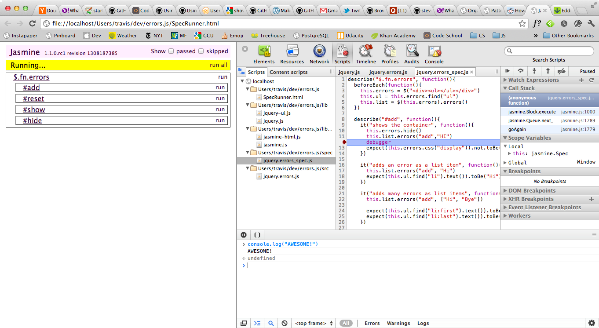

Chrome recently got a sweet new Web Inspector feature called Dock to right.
This feature allows you to vertically split your screen with your web page on
the left and Web Inspector tools on the right.

To enable it open the Web Inspector, click on the gear icon at the bottom right
of the Web Inspector and check off Dock to right. This feature was made
available in the stable channel on Mar 28/v18, so you should either have it or
just need to update!

Yep, it's pretty awesome. Especially since I'm always working on a wide-screen
display with both the Console and one of Scripts, Network, Elements, etc. open
in Chrome.

Thanks Chrome/Webkit devs!

Note: Safari's Web Inspector doesn't provide the Dock to right feature. :(
