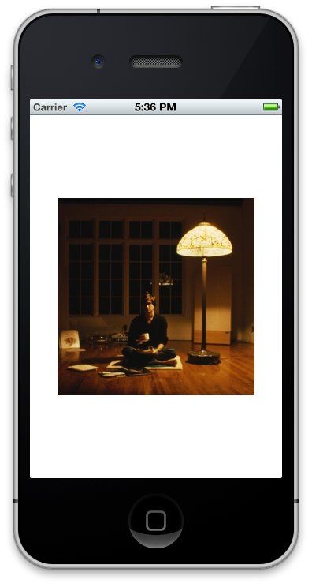
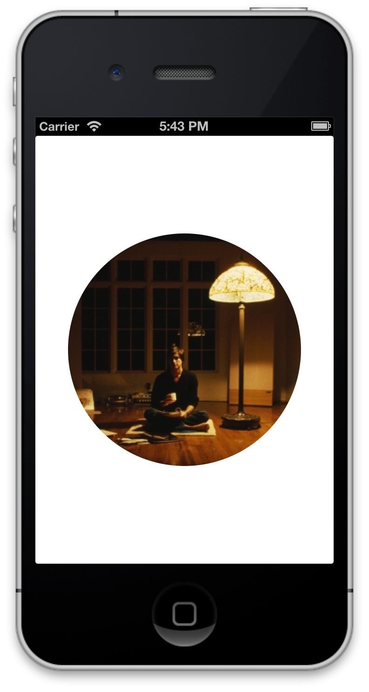
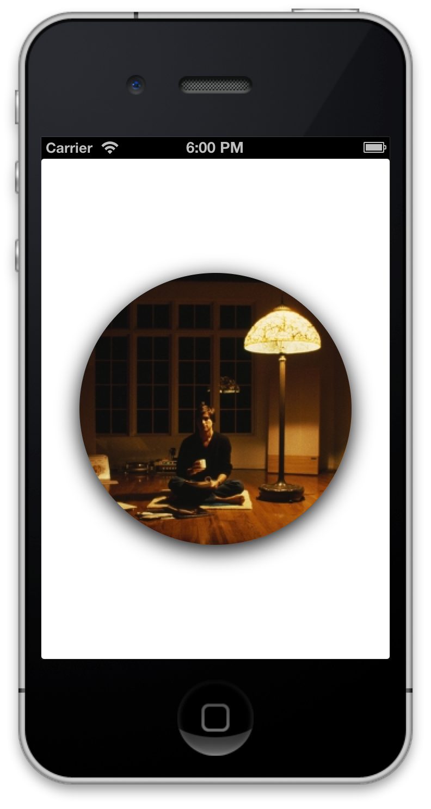

Two common techniques for making a visually appealing app are a liberal use
of masking and shadows, e.g. masking an image to be a circle or have round
corners, or adding a drop shadow to images or text to give them more
depth. Both of these techniques are pretty trivial in iOS on their own, but
are a bit of a intellectual leap to combine them at the same time. This post
will hopefully lessen that leap.

To summarize the technique we're going to use, we're going to mask the
image into a circle using its layer property, then add that layer to a
new container layer that will also shadow the image, and then add that container
layer with the masked and shadowed image as a sublayer of our view.

I've created a [project on
GitHub](https://github.com/travisjeffery/ios-how-to-mask-and-shadow), and
[wrote my
commits](https://github.com/travisjeffery/ios-how-to-mask-and-shadow/commits/master/)
in such a way as to see the stages of building our final result.

Initially we just start with an image as a subview of our view with no
modifications other than centering it.



``` objc
//
//  TJViewController.m
//  MaskAndShadow
//
//  Created by Travis Jeffery on 2012-08-06.
//  Copyright (c) 2012 Travis Jeffery. All rights reserved.
//

#import "TJViewController.h"

@interface TJViewController ()

@end

@implementation TJViewController

- (void)viewDidLoad
{
    [super viewDidLoad];

    // white bg to see the shadow easier
    self.view.backgroundColor = [UIColor whiteColor];

    // the image we're going to mask and shadow
    UIImageView* image = [[UIImageView alloc] initWithImage:[UIImage imageNamed:@"sj.jpeg"]];
    image.center = self.view.center;

    [self.view addSubview:image];
}

@end
```

Then we manipulate our image into a circle by rounding and masking its
corners.



``` objc
//
//  TJViewController.m
//  MaskAndShadow
//
//  Created by Travis Jeffery on 2012-08-06.
//  Copyright (c) 2012 Travis Jeffery. All rights reserved.
//

#import "TJViewController.h"

@interface TJViewController ()

@end

@implementation TJViewController

- (void)viewDidLoad
{
    [super viewDidLoad];

    // white bg to see the shadow easier
    self.view.backgroundColor = [UIColor whiteColor];

    // the image we're going to mask and shadow
    UIImageView* image = [[UIImageView alloc] initWithImage:[UIImage imageNamed:@"sj.jpeg"]];
    image.center = self.view.center;

    // use the image's layer to mask the image into a circle
    image.layer.cornerRadius = roundf(image.frame.size.width/2.0);
    image.layer.masksToBounds = YES;

    [self.view addSubview:image];
}

@end
```

Since our shadow will also be masked if we just tried to add to the image as it
is now, we add the masked image's layer to an unmasked container layer that
will also add shadow the image, and then we add that container layer with the
masked and shadowed image as a sublayer of our view.



``` objc
//
//  TJViewController.m
//  MaskAndShadow
//
//  Created by Travis Jeffery on 2012-08-06.
//  Copyright (c) 2012 Travis Jeffery. All rights reserved.
//

#import "TJViewController.h"
#import <QuartzCore/QuartzCore.h>

@interface TJViewController ()

@end

@implementation TJViewController

- (void)viewDidLoad
{
    [super viewDidLoad];

    // white bg to see the shadow easier
    self.view.backgroundColor = [UIColor whiteColor];

    // the image we're going to mask and shadow
    UIImageView* image = [[UIImageView alloc] initWithImage:[UIImage imageNamed:@"sj.jpeg"]];
    image.center = self.view.center;

    // make new layer to contain shadow and masked image
    CALayer* containerLayer = [CALayer layer];
    containerLayer.shadowColor = [UIColor blackColor].CGColor;
    containerLayer.shadowRadius = 10.f;
    containerLayer.shadowOffset = CGSizeMake(0.f, 5.f);
    containerLayer.shadowOpacity = 1.f;

    // use the image's layer to mask the image into a circle
    image.layer.cornerRadius = roundf(image.frame.size.width/2.0);
    image.layer.masksToBounds = YES;

    // add masked image layer into container layer so that it's shadowed
    [containerLayer addSublayer:image.layer];

    // add container including masked image and shadow into view
    [self.view.layer addSublayer:containerLayer];
}

@end
```

