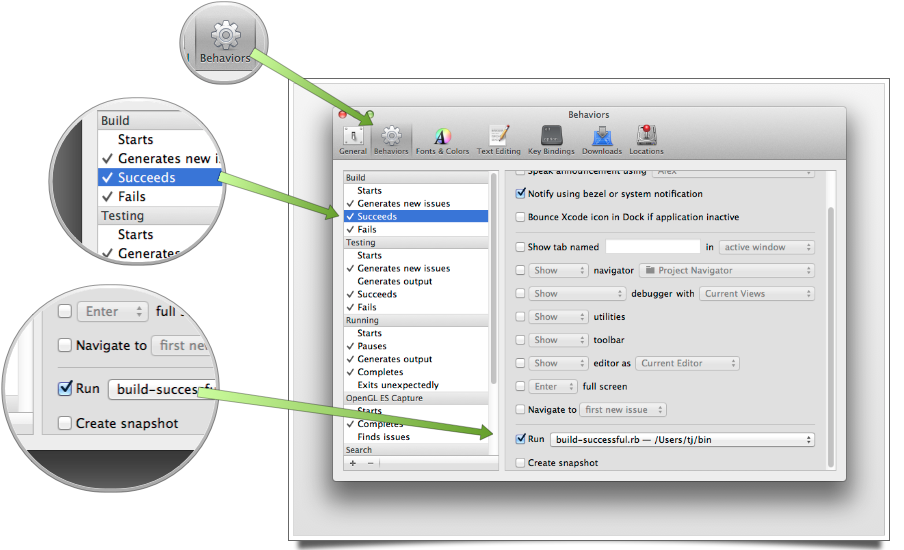
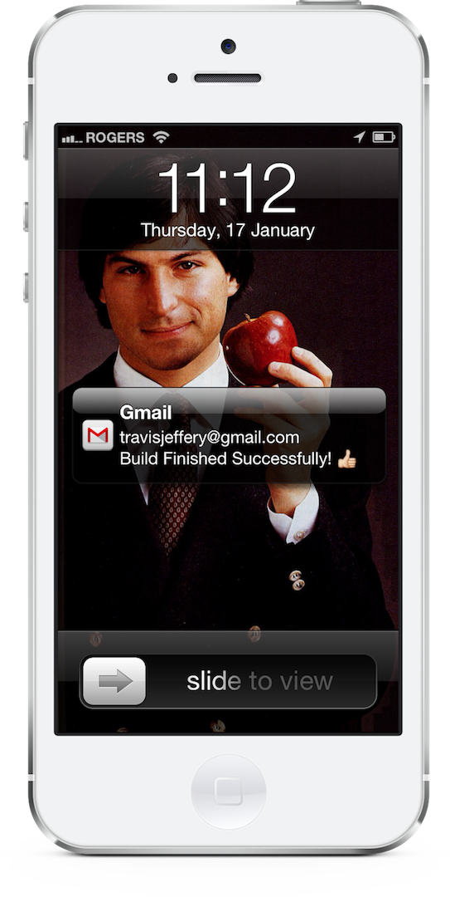

Compiling sucks, for the most part, and while it's getting better with smarter compilers and faster computers this is what it often feels like:


So instead of sitting there, you head over to the kitchen, make a fresh cup of tea, and see how your friends and co-workers are doing. But what if your build failed right after you got up, or it was successful and you're really excited to check out some animation you've been working on... then you want to know right away!

I've got an iPhone, a Gmail app with push notifications, and Xcode can run scripts when builds finish... let's do this!

Open up Xcode's preferences, and configure things like so:



Here's what the Ruby script looks like, you'll need to install the `tlsmail` gem.

``` ruby
#!/usr/bin/env ruby
# encoding: utf-8

require "rubygems"
require "tlsmail"

my_actual_email_address = "...@gmail.com"

my_sending_email_address = "...@gmail.com"
my_sending_email_password = "..."

email_content = <<EOF
From: #{my_sending_email_address}
To: #{my_actual_email_address}
Subject: Build Finished Successfully! 👍
Date: #{Time.now}
EOF

Net::SMTP.enable_tls(OpenSSL::SSL::VERIFY_NONE)
Net::SMTP.start("smtp.gmail.com", 587, "gmail.com", my_sending_email_address, my_sending_email_password, :login) do |smtp|
  smtp.send_message(email_content, my_sending_email_address, my_actual_email_address)
end
```



Here `my_actual_email_address` is the account that I want the email sent to, and `my_sending_email_address` is just some email account I setup specifically for this so I didn't have to  worry about storing my password in plain text, or mess around with encrypting/decrypting it.

Now when I'm sitting there drinking my tea with my co-workers, I get my notification on my phone, and I know right away that the build finished and if it was successful.

How compiling feels now:


