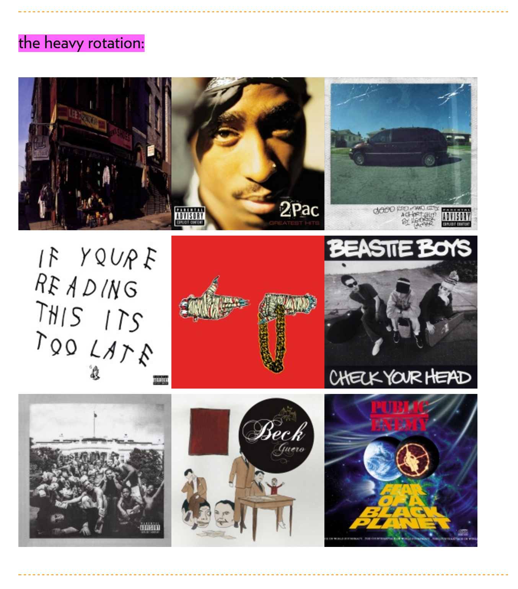

I thought it'd be cool to show what albums I'm listening to lately on my site, so I wrote a client lib and
and Amazon Lambbda function to get the albums from your Rdio Heavy Rotation and put them on your site.

You can check it out on my [site](http://travisjeffery.com) under "the heavy rotation".

The Lambda function authenticates with Rdio and fetches the data for the client, and the client
adds the imgs to the web page.

Here's the [client code](https://github.com/travisjeffery/thr-client) on GitHub, and here's the [Lambda code](https://github.com/travisjeffery/thr-lambda) on GitHub.
