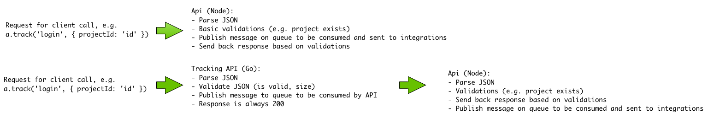

From a very high level POV, here's how Segment's API used to work and works now:

Our traffic is to the point where performance problems started emerging where we were blocking our Node api's event loop, primarily due to object reification
when serializing JSON. To alleviate this issue, we put an api in-front of the api, which we call the tracking api. The tracking api is written in go so we can make
use of it's concurrency primitives that allow us to always handle and validate incoming requests before sending it putting it onto NSQ for the rest of the system to read.

The only disadvantage is that the tracking api always sends back 200s, so we're going to make those errors visible in our ui. Which will be awesome because we'll be able to
other errors visible as well, such as errors that happen during the calls to the integrations.

Update: We now show those errors in the ui, [check it out](https://segment.com/blog/announcing-integration-errors-in-the-debugger/)!
