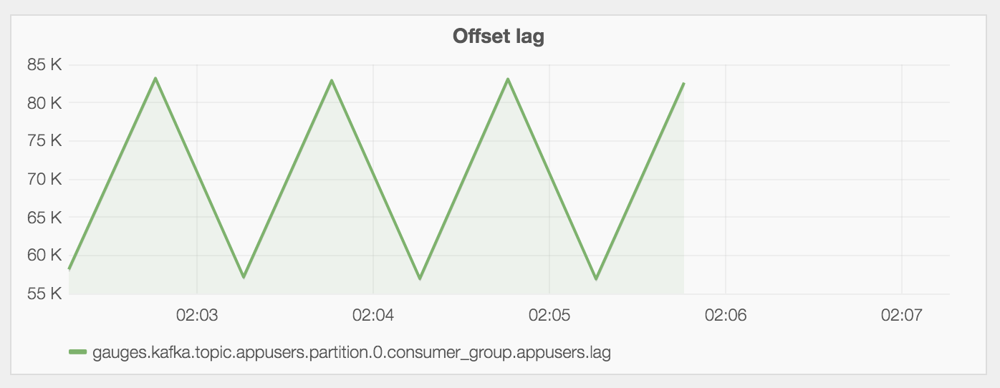

I wrote a [worker](https://github.com/travisjeffery/kafka-statsd) to track consumer offset lags with StatsD so that you
can graph them in Grafana or something similar.

It's written in Golang and there's a Docker image too, so it's easy to deploy and use.

[Check it out on GitHub.](https://github.com/travisjeffery/kafka-statsd)

